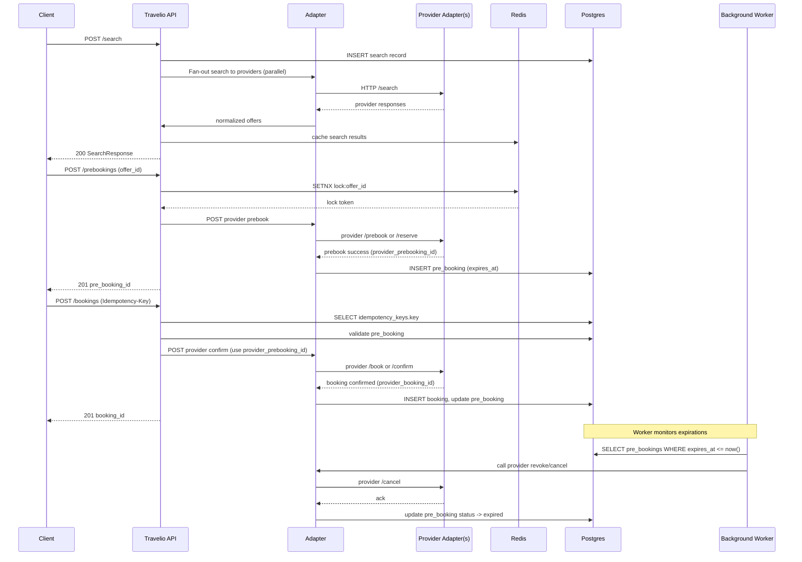

Diagrama de secuencia (mermaid) - Flujos principales


```mermaid
sequenceDiagram
  participant Client
  participant API as Travelio API
  participant Adapter
  participant Provider as Provider Adapter(s)
  participant Redis
  participant Postgres
  participant Worker as Background Worker

  Client->>API: POST /search
  API->>Postgres: INSERT search record
  API->>Adapter: Fan-out search to providers (parallel)
  Adapter->>Provider: HTTP /search
  Provider-->>Adapter: provider responses
  Adapter->>API: normalized offers
  API->>Redis: cache search results
  API-->>Client: 200 SearchResponse

  Client->>API: POST /prebookings (offer_id)
  API->>Redis: SETNX lock:offer_id
  Redis-->>API: lock token
  API->>Adapter: POST provider prebook
  Adapter->>Provider: provider /prebook or /reserve
  Provider-->>Adapter: prebook success (provider_prebooking_id)
  Adapter->>Postgres: INSERT pre_booking (expires_at)
  API-->>Client: 201 pre_booking_id

  Client->>API: POST /bookings (Idempotency-Key)
  API->>Postgres: SELECT idempotency_keys.key
  API->>Postgres: validate pre_booking
  API->>Adapter: POST provider confirm (use provider_prebooking_id)
  Adapter->>Provider: provider /book or /confirm
  Provider-->>Adapter: booking confirmed (provider_booking_id)
  Adapter->>Postgres: INSERT booking, update pre_booking
  API-->>Client: 201 booking_id

  Note over Worker,Postgres: Worker monitors expirations
  Worker->>Postgres: SELECT pre_bookings WHERE expires_at <= now()
  Worker->>Adapter: call provider revoke/cancel
  Adapter->>Provider: provider /cancel
  Provider-->>Adapter: ack
  Adapter->>Postgres: update pre_booking status -> expired
```
```